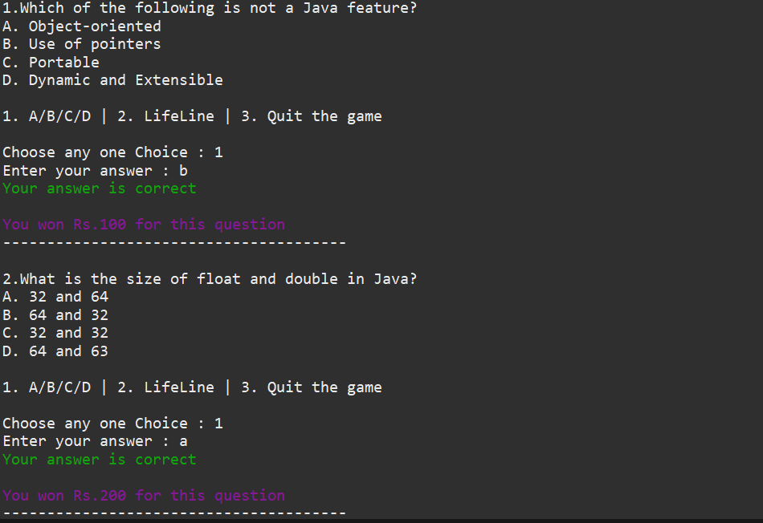
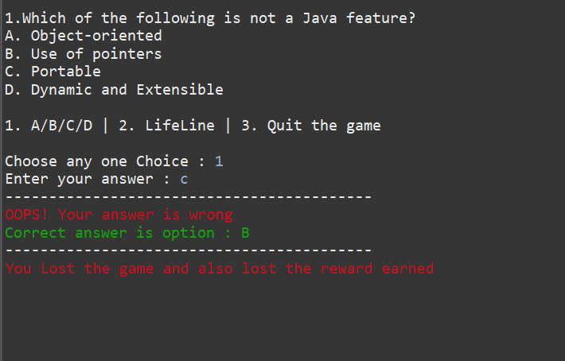
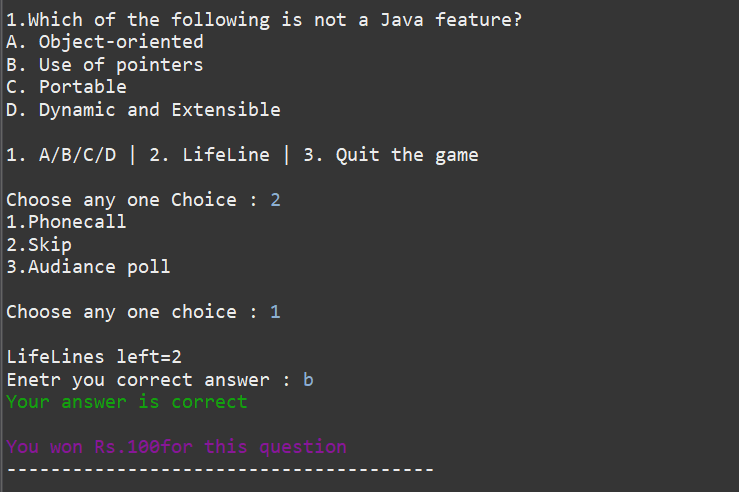
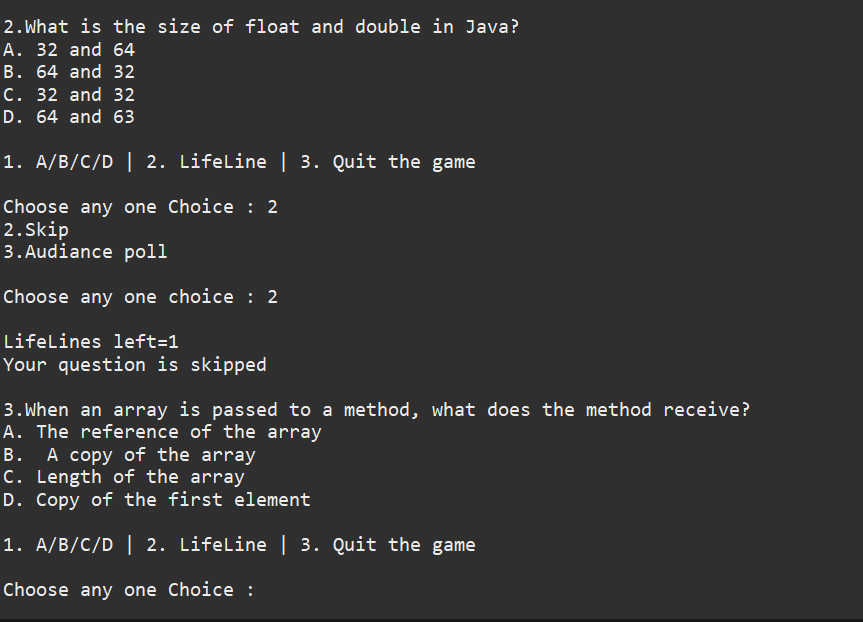
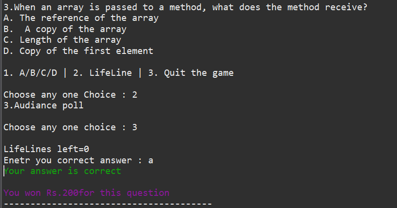
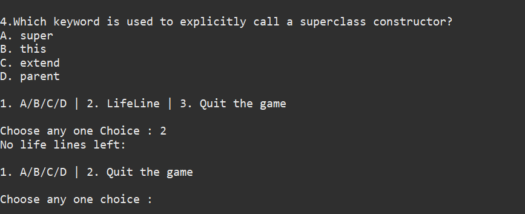
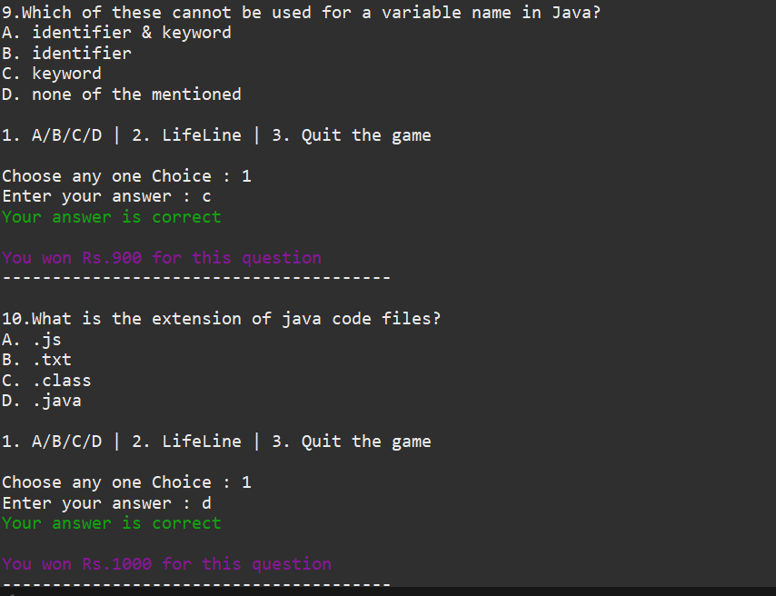

# Console-Based Quiz Application (Java)

## Overview
The **Console-Based Quiz Application** is a Java program that simulates a KBC-style quiz game. 
It allows users to answer multiple-choice questions, receive instant feedback, and earn level-based rewards. 
Lifelines such as PhoneCall, Audience Poll, and Skip Question help users progress through the quiz. 
Safety checkpoints guarantee a minimum reward at specific stages, adding strategic depth and excitement.

## Features
- Multiple-choice questions with four options (A, B, C, D)
- Instant feedback on answers (Correct / Incorrect)
- Level-based rewards instead of cumulative scoring
- Lifelines:
  - **Phone Call**: Eliminates two wrong options
  - **Audience Poll**: Suggests the most likely answer
  - **Skip Question**: Skip a difficult question
- Lifelines can be used only once and in early levels
- Safety checkpoints guarantee a minimum reward even after a wrong answer
- Console-based design for simplicity and clarity

## Technologies Used
- **Programming Language**: Java  
- **Core Concepts**: Arrays, Loops, Conditional Statements, Variables, Strings  
- **Design**: Console-based interface

## Screenshots 
Below are some screenshots of the Console-Based Quiz Application in action:

1. **Correct Answer Feedback**  
Shows when the user selects the correct answer.  

2. **Wrong Answer Feedback**  
Shows when the user selects a wrong answer.  

3. **Phone Call Lifeline**  
Example of using the Phone Call lifeline during the quiz.  

4. **Skip Question Lifeline**  
Example of skipping a difficult question.  

5. **Audience Poll Lifeline**  
Shows the audience poll suggestion for a question.  

6. **No Lifelines Left**  
Option to reuse a previously used lifeline.  

7. **Winning Score**  
Displays the current winnings of the user during gameplay.  

## Future Enhancements
- Add a **Graphical User Interface (GUI)** using Java Swing  
- Include a **timer for each question**  
- Store questions in an **external file or database** for easy updates  

## Author
**Kavya B S**  

## Acknowledgments
I would like to express my sincere gratitude to **Raghu Sir** for his valuable guidance and support throughout the development of this project. His mentorship helped me understand key programming concepts and implement the quiz application effectively.

